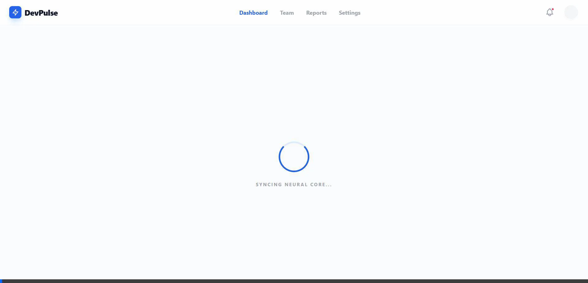

# 🚀 DevPulse: Developer Productivity Dashboard


## 🌟 Overview
**DevPulse** is a high-fidelity, production-grade developer productivity dashboard built during my **Software Development Internship** at **[TheProductWorks.in](https://TheProductWorks.in)**. 

In modern engineering teams, visibility into the development lifecycle is often a "black box". DevPulse solves this by aggregating raw engineering data—from Pull Requests, Deployment logs, and Team performance—into a centralized, real-time analytics hub. It transforms invisible patterns into actionable insights.

---

## 📽️ Live Demo


*Showcasing real-time metric updates, interactive Recharts visualizations, and automated health insights.*

---

## ✨ Key Features

### 📊 Real-Time Metrics & Analytics
- **Lead Time for Changes**: Measures the time from code commit to production.
- **Cycle Time**: Tracks the speed of the development loop from 'In Progress' to 'Merged'.
- **Deployment Frequency**: Visualizes how often the team is shipping value.
- **PR Throughput**: Monitors team output and identifies collaboration bottlenecks.
- **Bug Rate Intelligence**: Automatically flags quality drops when bugs exceed 2%.

### 🧠 Analytics Engine (The "Brain")
The backend evaluation logic doesn't just show numbers—it generates **Insights** and **Action Plans**:
- **Status Categorization**: Green (Healthy), Amber (Caution), and Rose (Critical) indicators.
- **Automated Suggestions**: e.g., "Review CI/CD pipeline" or "Increase automated test coverage".

### 🏢 Team Intelligence
- **Developer Profiles**: Track seniority (Lead, Senior, Junior) and current status.
- **Activity Streams**: Real-time logging of PR interactions and system updates.

---

## 🛠️ Tech Stack
- **Frontend**: React 19, Vite, Tailwind CSS, Recharts, Lucide React.
- **Backend**: Node.js, Express, Mongoose.
- **Database**: MongoDB (with flexible schema for varied engineering logs).
- **Design**: Premium Glassmorphism UI with a focus on SaaS-quality aesthetics.

---

## 📂 Project Structure
```bash
├── frontend/        # React + Vite (High-fidelity UI)
├── backend/         # Node.js + Express (Analytics Engine)
├── assets/          # Demo Video & Images
└── README.md        # Documentation
```

---

## 🚀 Ongoing Work (Internship)
This project is currently being developed as part of the **Software Development Internship** at **TheProductWorks.in**. 
Upcoming features include:
- [ ] Direct Jira/GitHub Webhook integrations.
- [ ] Advanced predictive analytics for release dates.
- [ ] Customizable team-specific reporting dashboards.

---

## 👨‍💻 Author

**Hasnain Khan**  
*Lead Developer & Architect*

- [GitHub](https://github.com/Hexecutionerr)
- [LinkedIn](https://www.linkedin.com/in/hasnain-khan-0ab3b2320)

---

> [!TIP]
> This project was developed as a high-fidelity MVP to demonstrate the power of data-driven engineering management.

---
© 2024 DevPulse | Developed for TheProductWorks.in Internship